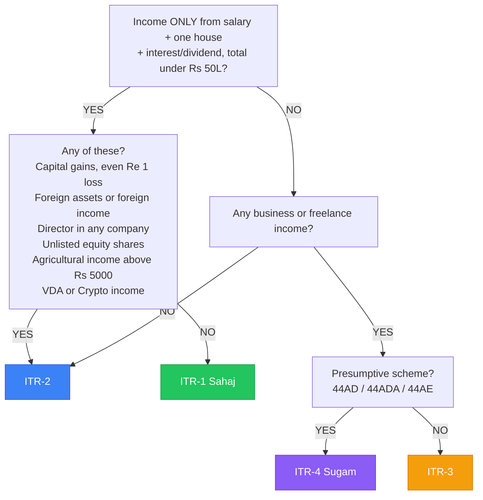

# ITR Form Selection — Complete Reference

## Decision Tree

## ITR-1 (Sahaj) — Eligibility
- Resident individual only (not NRI, not RNOR)
- Salary income (single employer preferred)
- One house property (self-occupied or let-out)
- Other sources: savings interest, dividends, family pension
- Total income ≤ ₹50 lakhs
- Agricultural income ≤ ₹5,000

## ITR-2 — Who Must Use It
- Income > ₹50 lakhs
- Capital gains or losses (any type, any amount)
- Foreign assets (bank account, stocks, property, brokerage)
- Foreign income (dividends, salary from foreign employer, rental)
- More than one house property
- Director in any company (listed or unlisted)
- Holds unlisted equity shares
- Agricultural income > ₹5,000
- NRI or RNOR status
- VDA / Crypto income

## ITR-3 — Business + Salary
- Salary + business/professional income
- F&O trading (treated as business income)
- Intraday trading (speculative business)
- Freelance with significant income
- Requires books of accounts if turnover > ₹1 crore

## ITR-4 (Sugam) — Presumptive Business
- Business income u/s 44AD: turnover ≤ ₹3 crore, declare 8%/6% as profit
- Professional income u/s 44ADA: receipts ≤ ₹75 lakh, declare 50% as profit
- Transport u/s 44AE
- Cannot have capital gains, foreign assets, or income > ₹50L

## Special Cases

### NRI / RNOR
- Use ITR-2
- Residential status: Non-Resident OR Resident but Not Ordinarily Resident
- Foreign income taxable only if received/accrued in India (NRI)
- RNOR: Indian income fully taxable, foreign income partially

### Multiple Employers
- ITR-1 or ITR-2 based on other criteria
- Add salary from all employers in Schedule S
- Each employer's TDS separately in Tax Paid schedule

### Pensioners
- Pension = salary income → ITR-1 or ITR-2
- Family pension = Other Sources
- Commuted pension: partially exempt u/s 10(10A)
